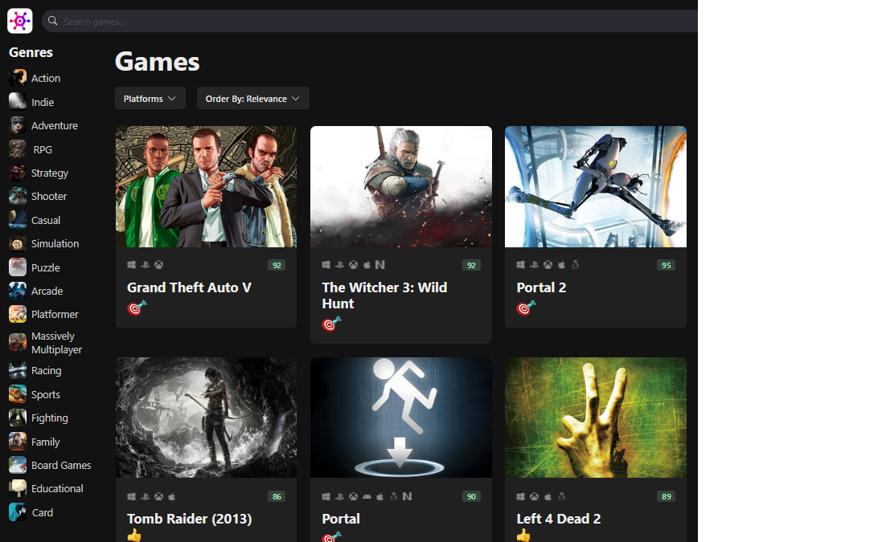

<h1>Video Game Discovery App</h1>

This is a mini version of [RAWG](https://rawg.io/) website, a popular video game discovery platform.

In the first part of this project i developed many useful features, for example, we can toggle between dark and light mode, search for games, filter by genre, as the games are loading we can see loading skeletons, we can filter by platform,
sort the games by different filters. Also i developed several UI patterns you'll see in modern applications.

Used technologies and tools:

- TypeScript
- Vite @4.0.1
- [Chakra UI](https://chakra-ui.com/)-> I decided to use this library to style the app because it give us a bunch of beautiful and reusable React components, i can get to the style i want with minimal customization.
- [AXIOS](https://axios-http.com/es/docs/intro) -> For handling HTTP requests.
- React Icons -> Rendering Icons.
- Vercel -> Deploying.
